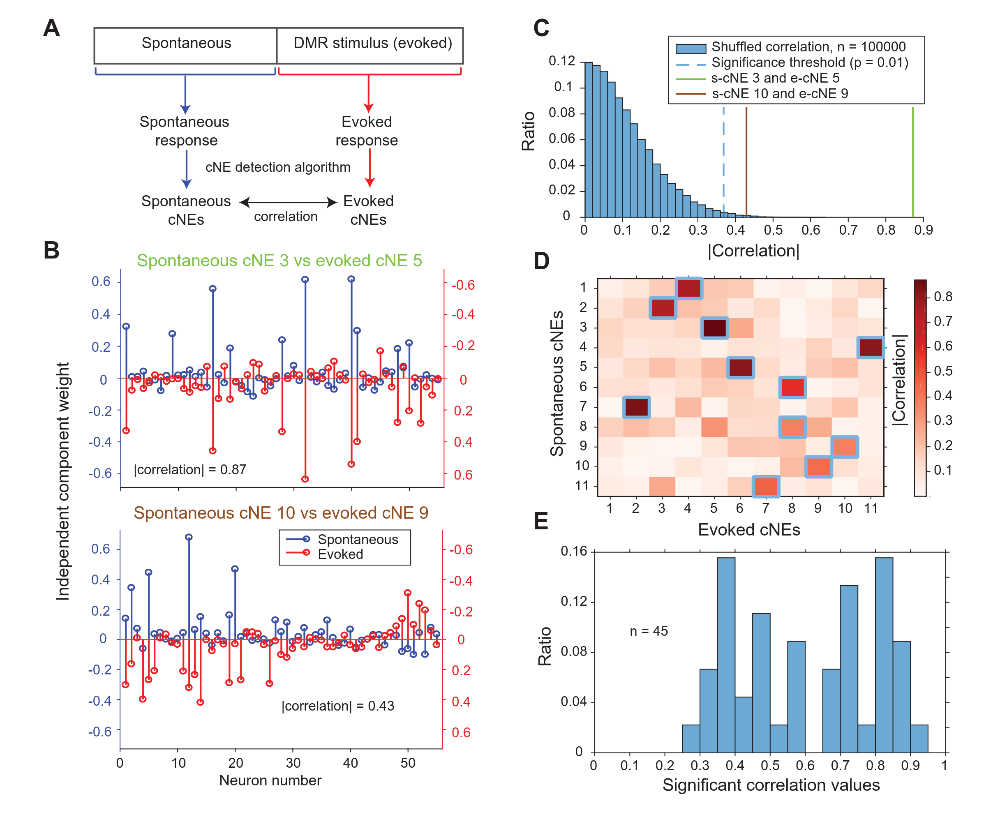

# cNE-project
Code used for the auditory coordinated neuronal ensembles project. Codes are organized by papers they were used in.

## Paper 1
**Coordinated neuronal ensembles in primary auditory cortical columns** 

See mansucript [here](https://elifesciences.org/articles/35587). Get PDF files for [main manuscript](./See%20et%20al%2C%202018.pdf) and [supplements](./See%20et%20al%2C%202018%20Supplement.pdf).

To get data, go [here](https://crcns.org/data-sets/ac/ac-3/about-ac-3).

### Code usage
To see how figures are plotted, see 'FigureScripts' subfolder. All other analysis codes are found in the main folder.

### Example figure
**Figure 8.** Coordinated neuronal ensembles are highly preserved across spontaneous and evoked activity.

## Paper 2
In prep... stay tuned!
